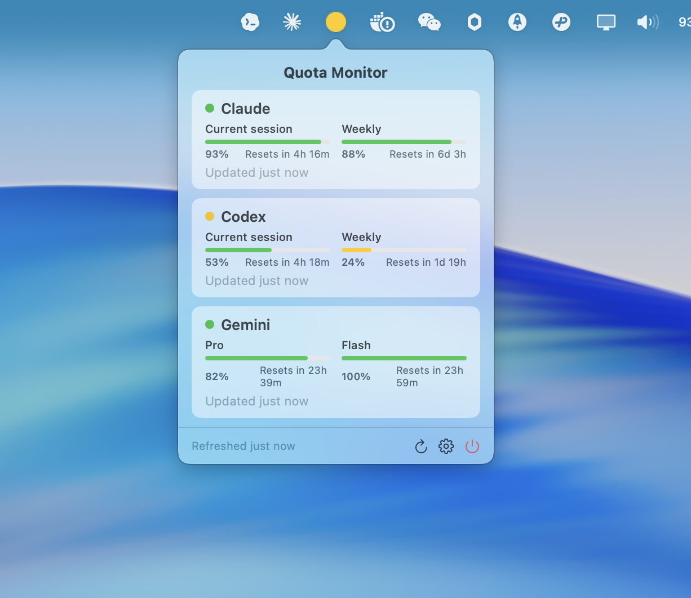

# Quota

**1. 一句话介绍**
苦于每天挨个查大模型 API 余额太烦了，所以随手搓了这个 macOS 状态栏小工具。它能自动读取你本地已有的 CLI 凭证，无需重新登录，即可在状态栏直观查看各模型的剩余可用额度。

**2. 截图**
 <!-- 待添加实际截图 -->

**3. 部署/使用命令**
前往 [Releases](https://github.com/panjuntao003/quota/releases/latest) 下载最新的 `Quota-x.x.x.dmg`，拖入应用程序文件夹即可使用。

如果想自己从源码编译：
```bash
brew install xcodegen
xcodegen generate
xcodebuild -project Quota.xcodeproj -scheme Quota -destination "platform=macOS" build
```

**4. 支持的模型/工具列表**
自动读取以下工具的本地凭证，无需额外配置 Key：
- **Claude** (Anthropic) —— 读取 `Claude Code` 凭证
- **Gemini** (Google) —— 读取 `Gemini CLI` 凭证
- **Codex** (OpenAI) —— 读取 `Codex CLI` 凭证
